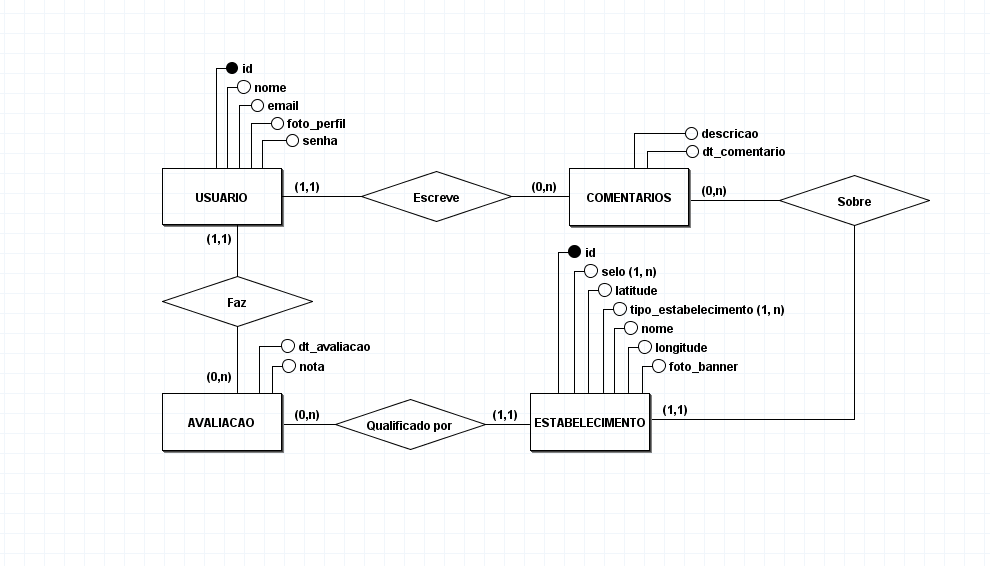

# TRABALHO DE PI:  Wheelieway: Aplicação de avaliação de estabelecimentos com base na acessibilidade
Trabalho desenvolvido durante a disciplina de Banco de Dados do Integrado
## Kanban
https://github.com/users/caiofraga123/projects/3

# Sumário

### 1. COMPONENTES 
Integrantes do grupo 
Rafael Barbosa Martins:rafaelmartinscouto@gmail.com 
Gabriel de Paula Brunetti:gabrieldpbrunetti@gmail.com 
Caio Fraga Coelho Cintra:caiofcintra@gmail.com 
Matheus Santos Nascimento:ifrn.jucurutu@gmail.com 

### 2.MINIMUNDO 
Descrever o mini-mundo! (Não deve ser maior do que 30 linhas, se necessário resumir para justar)
Entrevista com o usuário e identificação dos requisitos.(quando for o caso de sistemas com cliente real)
Descrição textual das regras de negócio definidas como um subconjunto do mundo real cujos elementos são propriedades que desejamos incluir, processar, armazenar, gerenciar, atualizar, e que descrevem a proposta/solução a ser desenvolvida.
 

> O sistema proposto para a "Wheelie Way" conterá as informacões aqui detalhadas. Dos Usuarios serão armazenados o id, nome, email, senha, bio e foto_perfil. De Tipo_Contato será armazenado id e descricao. O Usuário pode ter nenhum ou vários tipos de contato e um Tipo_contato pode pertencer a nenhum ou vários usuarios. De Estabelecimento será armazenado id, nome, selo, latitude, tipo_estabelecimento, longitude e foto_banner. De Avaliacao, será armazenado dt_avaliacao e nota. Um Usuario pode fazer nenhuma ou várias avaliações enquanto uma Avaliacao pode ser feita por um e por apenas um usuário. Um Estabelecimento pode ter nenhuma ou várias qualificações feitas por uma avaliação enquanto uama Avaliacao pode qualificar um e apenas um estabelecimento. De Visitas será armazenado dt_visita. Um Usuario pode realizar nenhuma ou várias visitas enquanto uma Visita pode ser realizada por um e por apenas um usuário. Um Estabelecimento pode ter nenhuma ou várias visitas feitas enquanto uma Visita pode ser feita a um e apenas um estabelecimento. De Comentarios será armazenado descricao e dt_comentario. Um Usuario pode escrever nenhum ou vários comentários enquanto uma Comentario pode ser escrito por um e por apenas um usuário. Um Estabelecimento pode ter nenhum ou várias comentários escritos enquanto um Comentario pode ser escrito sobre um e apenas um estabelecimento.
 
 
### 3.PMC 
 

#### 3.1. EAP - Estrutura Analítica do Projeto
.svg "EAP") 
##### Dicionário do EAP
 

#### 3.2. Requisitos funcionais e não funcionais
##### Requisitos funcionais
  
##### Requisitos não funcionais
  

#### 3.3 Validação da Ideia.
a) Link do formulário desenvolvido
>https://docs.google.com/presentation/d/1qrSYh5bpCSe50ds1G_YrqRBXrvAJAaLTO2YMUFZ8IF4/edit?usp=sharing

b) Link para Relatório/Apresentação de resultados obtidos
>https://docs.google.com/forms/d/e/1FAIpQLSeIjW1dLSWuLkgC4TJp6YfD5qHpMWzX4Fn65itIjeFbh9xYrg/viewform

### 4.Personas e Histórias de usuário 
a) inclusão dos Persons desenvolvidos pelo grupo 

 
  
b) inclusão das Histórias de usuário desenvolvidas pelo grupo
 

### 5. PROTÓTIPOS DO SISTEMA 
Neste ponto a codificação não e necessária, somente as ideias de telas devem ser desenvolvidas. O princípio aqui é pensar na criação da interface para identificar possíveis informações a serem armazenadas e/ou descartadas  

Sugestão: https://balsamiq.com/products/mockups/ 

#### 5.1 PROTÓTIPO DO SISTEMA MOBILE
Teste: https://quant-ux.com/#/test.html?h=a2aa10a35CHHhwHEySoH5G6qam0ce65GzUhN7BYFadNt0uannX6yJyutiZSO&ln=en

Telas: https://quant-ux.com/#/apps/641aeb7d05d7232656948d45/design/s10183_68866.html

#### 5.2 PROTÓTIPO DO SISTEMA WEB
https://github.com/RafaBMartins/pi2023/tree/3cbca575d3772ea636ad87d6046196004ac586e8/web

#### 5.3 QUAIS PERGUNTAS PODEM SER RESPONDIDAS COM OS SISTEMA WEB/MOBILE PROPOSTOS?
    a) O sistema proposto poderá fornecer quais tipos de relatórios e informaçes? 
    b) Crie uma lista com os 5 principais relatórios que poderão ser obtidos por meio do sistema proposto!
    
> A Empresa DevCom precisa inicialmente dos seguintes relatórios:
* Relatório que mostre quais estabelecimentos foram avaliados e sua nota média de estrelas de classificação quanto à acessibilidade(máximo de 5)
* Relatório que agrupe os selos pelos seus tipos, mostrando somente o atributo selo e a quantidade de selos com o referido tipo.
* Relatório que mostre quais são os tipos de estabelecimento e qual a sua quantidade do tipo.
* Relatório que mostre quaal é a quantidade de visitas do tipos de estabelecimentos.
* Relatório  que mostre os usuários e suas contribuições.
 
 ### 6.MODELO CONCEITUAL 
    A) Utilizar a Notação adequada (Preferencialmente utilizar o BR Modelo 3)
    B) O mínimo de entidades do modelo conceitual pare este trabalho será igual a 4.
        * informe quais são as 3 principais entidades do sistema em densenvolvimento
      (se houverem mais de 3 entidades, pense na importância da entidade para o sistema)       
    C) Principais fluxos de informação/entidades do sistema (mínimo 2).  Dica: normalmente estes fluxos estão associados as tabelas que conterão maior quantidade de dados 
    D) Qualidade e Clareza
        Garantir que a semântica dos atributos seja clara no esquema (nomes coerentes com os dados).
        Criar o esquema de forma a garantir a redução de informação redundante, possibilidade de valores null, 
        e tuplas falsas (Aplicar os conceitos de normalização abordados).   
        

      
    
#### 7 Descrição dos dados 
    [objeto]: [descrição do objeto]
    
    EXEMPLO:
    USUARIO: Tabela que armazena as informações relativas ao usuário. 
    ID: Campo que armazena o número que identifica cada usuário. 
    NOME: Campo que armazena o nome do usuário. 
    EMAIL: Campo que armazena o email do usuário. 
    FOTO_PERFIL: Campo que armazena o link da foto de perfil do usuário. 
    SENHA: Campo que armazena a senha do usuário .
    
    TIPO_CONTATO: Tabela que armazena as informações relativas ao tipo de contato do usuário. 
    ID: Campo que armazena o número que identifica cada tipo de contato. 
    DESCRICAO: Campo que armazena a descrição definindo qual é o tipo de contato. 
    
    ESTABELECIMENTO: Tabela que armazena as informações relativas ao estabelecimento. 
    ID: Campo que armazena o número que identifica cada estabelecimento. 
    NOME: Cmapo que armazena o nome do estabelecimento. 
    LATITUDE: Campo que armazena qual será a latitude a fim de ter a localização. 
    LONGITUDE: Campo que armazena qual será a longitude a fim de ter a localização. 
    FOTO_BANNER: Campo que armazena o link que conterá a foto de banner do estabelecimento. 
    
    SELO: Campo multivalorado que armazena as informações relativas ao selo do estabelecimento. 
    TIPO_ESTABELECIMENTO: Campo multivalorado que armazena as informações relativas ao tipo do estbaelecimento. 
    
    AVALIACAO: Tabela que armazena as informações relativas à avaliação de um sobre um estabelecimento. 
    DT_AVALIACAO: Campo que armazena a data em que foi feita a avaliação. 
    NOTA: Campo que armazena a nota da avaliação feita pelo usuário sobre um estabelecimento. 
    
    COMENTARIOS: Tabela que armazena as informações relativas aos comentáris de um usuário sobre um estabelecimento. 
    DESCRICAO: Campo que armazena a descrição do usuário sobre o estabelecimento. 
    DT_COMENTARIO: Campo que armazena a data em que o cometário foi feito. 
    
    VISITAS: Tabela que armazena as informações relativas à visita de um usário a um estabelecimento. 
    DT_VISITA: Campo que armazena a data em que a visita do usuário foi feita. 

### 8	RASTREABILIDADE DOS ARTEFATOS 
        a) Historia de usuários vs protótipo (Histórias de Usuário e em qual tela do protótipo aquela HU está sendo realizada).
        b) Protótipo vs Modelo conceitual (Histórias de Usuário e em quais tabelas aquele dado está sendo registrado).
        (modelos devem obrigatoriamente estar em conformidade de rastreabilidade)

### 9	MODELO LÓGICO 
        a) inclusão do esquema lógico do banco de dados
        b) verificação de correspondencia com o modelo conceitual 
        (não serão aceitos modelos que não estejam em conformidade)

### 10	MODELO FÍSICO 
        
      CREATE TABLE USUARIO (
          id SERIAL PRIMARY KEY,
          foto_perfil VARCHAR (500),
          nome VARCHAR (50),
          email VARCHAR (50),
          senha VARCHAR (50),
          bio VARCHAR (500),
          FK_TIPO_id SERIAL
      );

      CREATE TABLE PESSOA (
          FK_deficiencia_deficiencia_PK SERIAL,
          FK_USUARIO_id SERIAL PRIMARY KEY
      );

      CREATE TABLE ESTABELECIMENTO (
          FK_selo_selo_PK SERIAL,
          horario_inicial DATE,
          FK_tipo_estabelecimento_tipo_estabelecimento_PK SERIAL,
          foto_banner VARCHAR (500),
          latitude VARCHAR (50),
          longitude VARCHAR (50),
          FK_USUARIO_id SERIAL PRIMARY KEY
      );

      CREATE TABLE TIPO_CONTATO (
          id SERIAL PRIMARY KEY,
          descricao VARCHAR (50)
      );

      CREATE TABLE TIPO (
          id SERIAL PRIMARY KEY,
          tipo VARCHAR (50)
      );

      CREATE TABLE AVALIACAO (
          nota FLOAT,
          dt_avaliacao DATE,
          FK_PESSOA_FK_USUARIO_id SERIAL,
          FK_ESTABELECIMENTO_FK_USUARIO_id SERIAL
      );

      CREATE TABLE VISITAS (
          dt_visita DATE,
          FK_PESSOA_FK_USUARIO_id SERIAL,
          FK_ESTABELECIMENTO_FK_USUARIO_id SERIAL
      );

      CREATE TABLE COMENTARIOS (
          descricao VARCHAR (500),
          dt_comentario DATE,
          FK_PESSOA_FK_USUARIO_id SERIAL,
          FK_ESTABELECIMENTO_FK_USUARIO_id SERIAL
      );

      CREATE TABLE deficiencia (
          deficiencia_PK SERIAL NOT NULL PRIMARY KEY,
          deficiencia VARCHAR (50)
      );

      CREATE TABLE selo (
          selo_PK SERIAL NOT NULL PRIMARY KEY,
          selo VARCHAR (50)
      );

      CREATE TABLE tipo_estabelecimento (
          tipo_estabelecimento_PK SERIAL NOT NULL PRIMARY KEY,
          tipo_estabelecimento SERIAL
      );

      CREATE TABLE Seguidor (
          fk_USUARIO_id SERIAL,
          fk_USUARIO_id_ SERIAL
      );

      CREATE TABLE Pertence (
          fk_TIPO_CONTATO_id SERIAL,
          fk_USUARIO_id SERIAL,
          descricao VARCHAR (50)
      );

      ALTER TABLE USUARIO ADD CONSTRAINT FK_USUARIO_2
          FOREIGN KEY (FK_TIPO_id)
          REFERENCES TIPO (id)
          ON DELETE CASCADE;

      ALTER TABLE PESSOA ADD CONSTRAINT FK_PESSOA_2
          FOREIGN KEY (FK_deficiencia_deficiencia_PK)
          REFERENCES deficiencia (deficiencia_PK)
          ON DELETE NO ACTION;

      ALTER TABLE PESSOA ADD CONSTRAINT FK_PESSOA_3
          FOREIGN KEY (FK_USUARIO_id)
          REFERENCES USUARIO (id)
          ON DELETE CASCADE;

      ALTER TABLE ESTABELECIMENTO ADD CONSTRAINT FK_ESTABELECIMENTO_2
          FOREIGN KEY (FK_selo_selo_PK)
          REFERENCES selo (selo_PK)
          ON DELETE NO ACTION;

      ALTER TABLE ESTABELECIMENTO ADD CONSTRAINT FK_ESTABELECIMENTO_3
          FOREIGN KEY (FK_tipo_estabelecimento_tipo_estabelecimento_PK)
          REFERENCES tipo_estabelecimento (tipo_estabelecimento_PK)
          ON DELETE NO ACTION;

      ALTER TABLE ESTABELECIMENTO ADD CONSTRAINT FK_ESTABELECIMENTO_4
          FOREIGN KEY (FK_USUARIO_id)
          REFERENCES USUARIO (id)
          ON DELETE CASCADE;

      ALTER TABLE AVALIACAO ADD CONSTRAINT FK_AVALIACAO_1
          FOREIGN KEY (FK_PESSOA_FK_USUARIO_id)
          REFERENCES PESSOA (FK_USUARIO_id)
          ON DELETE CASCADE;

      ALTER TABLE AVALIACAO ADD CONSTRAINT FK_AVALIACAO_2
          FOREIGN KEY (FK_ESTABELECIMENTO_FK_USUARIO_id)
          REFERENCES ESTABELECIMENTO (FK_USUARIO_id)
          ON DELETE CASCADE;

      ALTER TABLE VISITAS ADD CONSTRAINT FK_VISITAS_1
          FOREIGN KEY (FK_PESSOA_FK_USUARIO_id)
          REFERENCES PESSOA (FK_USUARIO_id)
          ON DELETE CASCADE;

      ALTER TABLE VISITAS ADD CONSTRAINT FK_VISITAS_2
          FOREIGN KEY (FK_ESTABELECIMENTO_FK_USUARIO_id)
          REFERENCES ESTABELECIMENTO (FK_USUARIO_id)
          ON DELETE CASCADE;

      ALTER TABLE COMENTARIOS ADD CONSTRAINT FK_COMENTARIOS_1
          FOREIGN KEY (FK_PESSOA_FK_USUARIO_id)
          REFERENCES PESSOA (FK_USUARIO_id)
          ON DELETE CASCADE;

      ALTER TABLE COMENTARIOS ADD CONSTRAINT FK_COMENTARIOS_2
          FOREIGN KEY (FK_ESTABELECIMENTO_FK_USUARIO_id)
          REFERENCES ESTABELECIMENTO (FK_USUARIO_id)
          ON DELETE CASCADE;

      ALTER TABLE Seguidor ADD CONSTRAINT FK_Seguidor_1
          FOREIGN KEY (fk_USUARIO_id)
          REFERENCES USUARIO (id)
          ON DELETE CASCADE;

      ALTER TABLE Seguidor ADD CONSTRAINT FK_Seguidor_2
          FOREIGN KEY (fk_USUARIO_id_)
          REFERENCES USUARIO (id)
          ON DELETE CASCADE;

      ALTER TABLE Pertence ADD CONSTRAINT FK_Pertence_1
          FOREIGN KEY (fk_TIPO_CONTATO_id)
          REFERENCES TIPO_CONTATO (id)
          ON DELETE SET NULL;

      ALTER TABLE Pertence ADD CONSTRAINT FK_Pertence_2
          FOREIGN KEY (fk_USUARIO_id)
          REFERENCES USUARIO (id)
          ON DELETE SET NULL;
       
### 11	INSERT APLICADO NAS TABELAS DO BANCO DE DADOS 
        a) inclusão das instruções de inserção dos dados nas tabelas criadas pelo script de modelo físico
        (Drop para exclusão de tabelas + create definição de para tabelas e estruturas de dados 
   + insert para dados a serem inseridos)
        b) Criar um novo banco de dados para testar a restauracao 
        (em caso de falha na restauração o grupo não pontuará neste quesito)
        c) formato .SQL

#### 12 PRINCIPAIS CONSULTAS DO SISTEMA 
 Inserir as principais consultas (relativas aos 5 principais relatórios) definidas previamente no iten 3.1 deste template.
  
  a) Você deve apresentar as consultas em formato SQL para cad um dos relatórios.
  
  b) Além da consulta deve ser apresentada uma imagem com o resultado obtido para cada consulta. 

 ### 13 Gráficos, relatórios, integração com Linguagem de programação e outras solicitações. 
     https://colab.research.google.com/drive/1aXXBjg6vr5BMXA1oWspFaLYMA0AUu7Rq?usp=sharing
 #### 13.1	Integração com Linguagem de programação;  
     https://colab.research.google.com/drive/1aXXBjg6vr5BMXA1oWspFaLYMA0AUu7Rq?usp=sharing
 #### 13.2	Desenvolvimento de gráficos/relatórios pertinentes, juntamente com demais  
 #### solicitações feitas pelo professor.  
 
 ### 14 Slides e Apresentação em vídeo.  
     OBS: Observe as instruções relacionadas a cada uma das atividades abaixo. 
 #### 14.1 Slides;  
 #### 14.2 Apresentação em vídeo  

    
##### About Formatting
    https://help.github.com/articles/about-writing-and-formatting-on-github/
    
##### Basic Formatting in Git
    
    https://help.github.com/articles/basic-writing-and-formatting-syntax/#referencing-issues-and-pull-requests
   
    
##### Working with advanced formatting
    https://help.github.com/articles/working-with-advanced-formatting/

#### Mastering Markdown
    https://guides.github.com/features/mastering-markdown/

### OBSERVAÇÕES IMPORTANTES

#### Todos os arquivos que fazem parte do projeto (Imagens, pdfs, arquivos fonte, etc..), devem estar presentes no GIT. Os arquivos do projeto vigente não devem ser armazenados em quaisquer outras plataformas.
1. Caso existam arquivos com conteúdos sigilosos, comunicar o professor que definirá em conjunto com o grupo a melhor forma de armazenamento do arquivo.

#### Todos os grupos deverão fazer Fork deste repositório e dar permissões administrativas ao usuário deste GIT, para acompanhamento do trabalho.

#### Os usuários criados no GIT devem possuir o nome de identificação do aluno (não serão aceitos nomes como Eu123, meuprojeto, pro456, etc). Em caso de dúvida comunicar o professor.

Link para BrModelo: 
http://sis4.com/brModelo/brModelo/download.html
 

Link para curso de GIT 

##### Github pages
https://rafabmartins.github.io/pi2023/web/html/index.html
